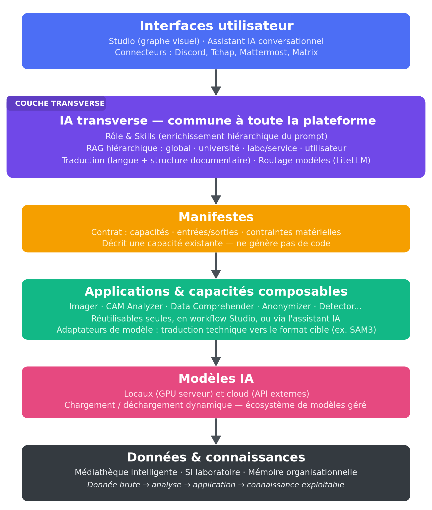
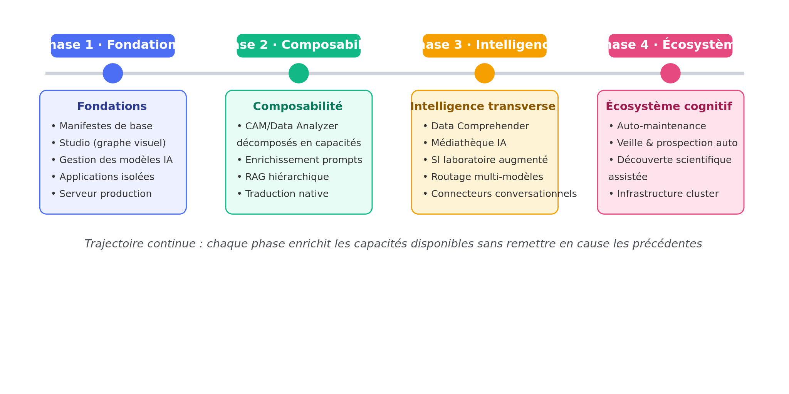

# WAMA — Web App for Multimodal Automation

*Vision, architecture et trajectoire — document de référence unique*

**Août 2026**

> ---
> ### 🧭 À propos de ce document
>
> Ce document **remplace** la vision v1 (juillet 2026), sa v2 annotée, l'analyse critique et
> l'état des lieux vision ↔ code — tous archivés : `docs/archive/WAMA_Vision_Complet.md`,
> `docs/archive/WAMA_Vision_Complet_v2.md`, `docs/archive/VISION_CRITIQUE.md`,
> `docs/archive/VISION_STATUS.md`. Les 13 correctifs de l'analyse critique, tissés en annotations
> dans la v2, sont ici fondus dans le texte de premier rang. La confrontation au réel, qui vivait
> dans l'ex-VISION_STATUS, vit désormais **dans le corps du document** sous forme de marquage par
> section.
>
> **Convention de lecture (discipline verbale)** : le **présent de l'indicatif décrit ce qui
> existe** ; le futur et le conditionnel décrivent ce qui est visé. Chaque partie porte un
> marquage d'état — **✅ acquis** · **🔄 en chantier** · **⏳ visé** · **📜 doctrine** (acté, pas du
> code) — daté de la dernière confrontation au code (2026-08-27 pour cette édition). Le marquage
> de maturité `[ÉTAGÈRE]` (intégration d'outils existants) / `[INGÉNIERIE]` (construction
> maîtrisée) / `[RECHERCHE]` (problème ouvert, axe de collaboration scientifique) qualifie les
> ambitions.
>
> **Ce que ce document n'est pas** : le suivi opérationnel des chantiers (→ `PROJECT_STATUS.md` +
> `ROADMAP.md`), ni la spécification des mécanismes (→ les docs de référence par domaine listés
> dans `CLAUDE.md`). Il donne le POURQUOI et le VERS QUOI ; les docs de domaine donnent le COMMENT.
> ---

---

# Sommaire

- **Résumé exécutif**
- **Partie 1 — Philosophie** : capitaliser plutôt que reproduire · métadonnée-driven ·
  sobriété numérique · reproductibilité et provenance
- **Partie 2 — Les quatre mondes** : Médias, Data, Lab, Transversal · la glu inter-mondes ·
  accès et appartenance organisationnelle · question ouverte : traçabilité des mondes
- **Partie 3 — Architecture fondatrice : les manifestes** : le manifeste comme contrat ·
  les 7 kinds · composition et anatomie · prospection et rôles LLM · auto-instanciation gatée
- **Partie 4 — Le Studio et l'orchestration**
- **Partie 5 — IA transverse** : rôle et skills · pipeline de prompts · traduction ·
  mémoire et RAG · adaptateurs de format · l'assistant comme interface
- **Partie 6 — Création multimédia** : apps génératives · médiathèque créative ·
  chaîne narrative (gatée)
- **Partie 7 — Le monde Lab** : Cam Analyzer, Face Analyzer, décomposition en capacités
- **Partie 8 — Le monde Data et l'apprentissage** : socle temporel · plan d'expérience ·
  Data Comprehender · garde-fous méthodologiques · modèles appris et boucle de simulation
- **Partie 9 — Médiathèque institutionnelle et système d'information** : conformité et confiance
- **Partie 10 — Opérations** : batch · auto-maintenance et vérification · veille et
  évaluation continue
- **Partie 11 — Infrastructure et modèle de réalisation**
- **Partie 12 — Interconnexion conversationnelle et routage des modèles**
- **Partie 13 — Non-objectifs, séquencement et parcours d'adoption**
- **Conclusion**

---

# Résumé exécutif

WAMA (**Web App for Multimodal Automation**) est une plateforme web d'intelligence artificielle
développée dans un laboratoire de recherche en sciences cognitives appliquées aux mobilités
(Université Gustave Eiffel). Née de besoins concrets — anonymisation RGPD de corpus vidéo,
transcription d'entretiens, préparation de stimuli expérimentaux, analyse de comportements — elle
est aujourd'hui **opérationnelle** : une douzaine d'applications en service (dix génériques, deux
métier), accessibles depuis un navigateur, exécutées sur GPU en interne, sans qu'aucune donnée de
recherche ne quitte l'établissement.

WAMA n'est pas un catalogue d'outils juxtaposés : c'est un environnement unifié où chaque
application déclare ses capacités (entrées, sorties, paramètres, modèles) dans un format commun —
le **manifeste** — qui permet de les enchaîner en pipelines reproductibles, de les piloter par un
assistant IA et de partager entre elles les ressources GPU et les modèles. Cette conception fait
de WAMA un **cadre d'accueil** : chaque nouveau modèle IA, chaque nouvelle application devient une
capacité supplémentaire de l'écosystème, immédiatement combinable avec les autres.

> **Une donnée brute → une analyse → une application → une connaissance exploitable.**

L'objectif n'est pas de remplacer les développeurs ou les chercheurs par une génération massive de
code : cette approche montre vite ses limites dès qu'il s'agit de systèmes complexes, maintenables
et cohérents. L'objectif est une **capitalisation** :

- les modèles deviennent des composants ;
- les applications deviennent des capacités ;
- les workflows deviennent des objets reproductibles ;
- les données deviennent intelligibles ;
- les connaissances deviennent accessibles.

---

# Partie 1 — Philosophie

## 1.1 Capitaliser plutôt que reproduire 📜

L'arrivée massive de nouveaux modèles d'IA crée un paradoxe bien connu des laboratoires : les
capacités progressent très vite, mais leur intégration opérationnelle reste longue et répétitive.
Chaque équipe recommence les mêmes tâches — installation de modèles, création d'interfaces,
gestion des paramètres, adaptation des formats, scripts jetables — et ce travail est rarement
mutualisé.

WAMA prend le contre-pied de cette dispersion. Sa philosophie tient en quatre temps :

1. **développer une fois** une capacité complexe ;
2. **la documenter** par un manifeste ;
3. **l'exposer** dans l'écosystème ;
4. **la réutiliser** dans de nouveaux contextes.

Le code devient une infrastructure stable, les applications des assemblages de capacités, les
workflows des objets reproductibles. Cette philosophie est appliquée dans le dépôt lui-même
(règle « zéro duplication, tout ce qui sert deux apps vit dans `common/` », briques communes
réutilisées par 4 à 12 applications) : la thèse n'est pas un vœu, elle est validée par la
pratique quotidienne du projet.

## 1.2 Métadonnée-driven : l'UI s'auto-génère ✅

L'interface ne s'écrit pas à la main application par application : elle **se génère à partir des
descriptions** des éléments (application, modèle, paramètre, item). Le volet de détail se remplit
depuis les métadonnées ; les modales de paramètres se rendent depuis un schéma déclaré ; le
descriptif d'un moteur vient de son catalogue ; les champs-prompt déclarent leur pipeline de
traitement. **Soigner les métadonnées à la source est ce qui remplit l'UI** — et c'est la même
source qui nourrit les manifestes, l'assistant et le Studio.

Corollaire : l'homogénéité est un objectif de design, pas un effet de bord. L'utilisateur
retrouve partout les mêmes gestes (mêmes boutons, même volet droit, même file d'attente) ; les
spécificités légitimes d'une application se **déclarent** (capacités, schémas) au lieu de se
coder en dur.

## 1.3 L'IA est dans la chaîne, pas à côté 📜

Traduction et enrichissement de prompts, correction assistée, sélection de modèle consciente de
la VRAM, auto-maintenance, prospection de modèles : l'IA n'est pas une application parmi
d'autres, elle est une **couche transverse** que toutes les applications traversent. Chaque
application expose en retour ses actions à l'assistant (API d'outils) : l'écosystème est
pilotable en langage naturel parce que chaque brique se décrit.

## 1.4 Sobriété numérique : le juste dimensionnement comme principe d'architecture 📜→🔄

L'usage courant de l'IA générative s'est installé sur un réflexe coûteux : adresser chaque
requête, même triviale, à de très grands modèles généralistes hébergés dans le cloud. Or une
grande partie des tâches réelles d'un laboratoire — transcrire un entretien, flouter une vidéo,
décrire une image, extraire un tableau — est accomplie aussi bien, et parfois mieux, par des
modèles spécialisés de taille dix à cent fois inférieure.

WAMA fait de ce constat un principe d'architecture, porté par des mécanismes concrets :

- **le juste dimensionnement par routage** — la couche de sélection oriente chaque requête vers
  le plus petit modèle capable de la traiter correctement (sélection VRAM-aware et par tiers,
  ✅ en place). Le recours à un modèle cloud reste possible mais devient un **choix explicite**,
  réservé aux tâches qui le justifient et aux données qui l'autorisent — jamais un défaut ;
- **des modèles résidents plutôt que rechargés** — maintien en mémoire GPU et partage entre
  applications (`keep_loaded`, ✅), au lieu de cycles de chargement/déchargement qui consomment
  sans produire ;
- **la mutualisation du matériel** — une infrastructure commune à bon taux de charge plutôt que
  des stations individuelles sous-utilisées ; les traitements massifs regroupés en lots et
  planifiés hors des pics (🔄 files batch en place, planification heures creuses ⏳) ;
- **la mesure comme condition du pilotage** — suivi de la consommation par utilisateur et par
  application (🔄 statistiques d'exécution par modèle en place ; rapport de sobriété ⏳) ;
- **la proximité des données** — les corpus volumineux sont traités sur le réseau local : aucun
  aller-retour massif vers des infrastructures distantes.

Ce positionnement se veut rigoureux plutôt que militant : l'argument porte sur ce qui dépend
réellement de la plateforme — dimensionner le modèle à la tâche, éviter le gaspillage de cycles,
mutualiser, mesurer — et il converge avec les arguments de souveraineté et de coût.

## 1.5 Reproductibilité et provenance : garantie de premier rang 📜→🔄

Une tension traversait les premières versions de cette vision : « l'utilisateur n'a pas à savoir
quel modèle tourne » contre « les workflows sont reproductibles ». Elle est tranchée : le confort
d'abstraction vaut pour l'USAGE, jamais pour la PREUVE. **L'orchestration choisit librement le
modèle, mais chaque exécution journalise modèle, version, paramètres et données d'entrée**, et
tout résultat doit pouvoir être restitué en « fiche de méthode » citable — un matériel et
méthodes prêt pour publication. Les germes existent (états de run du Studio, statistiques
d'exécution par modèle, `extra_info` des items) ; l'érection en garantie exportable de premier
rang est en chantier. Pour une plateforme de recherche, c'est la provenance qui est l'objet
scientifique — l'abstraction devient un argument au lieu d'une contradiction.

---

# Partie 2 — Les quatre mondes

> 📜 Doctrine actée le 2026-07-20, traduite en arborescence le 2026-08-22 (trois racines de code).
> C'est l'ossature de la plateforme : **WAMA s'organise en mondes qui communiquent** et
> convergent en deux lieux de rencontre — le **Studio** (chaînage) et la **médiathèque**
> (partage).

## 2.1 Les mondes et leur nature

| Monde | Contenu | Entrées/sorties | État (2026-08-27) |
|---|---|---|---|
| **Médias** | les applications génériques de traitement de médias | média → média | ✅ dix apps en service |
| **Data** | le moteur de données scientifiques (`wama_data/`) : référentiel temporel, lecteurs, fonctions typées, sessions | données → tri/traitement → données | 🔄 socle réel (moteur sans UI) |
| **Lab** | les applications métier de recherche (`wama_lab/`) | domaine-spécifique | 🔄 Cam Analyzer avancé, Face Analyzer embryon |
| **Transversal** | le substrat commun : assistant IA, model manager, mémoire/RAG, pipeline de prompts, Studio, médiathèque, comptes | services partagés | 🔄 riche et vivant |

**Monde Médias — les dix applications génériques ✅** : Anonymizer (floutage visages/plaques,
conformité RGPD), Transcriber (transcription multi-moteurs, diarisation, éditeur de correction
assisté), Synthesizer (synthèse vocale, clonage de voix), Describer (description IA de médias par
LLM multimodaux locaux), Reader (OCR typographié et manuscrit), Imager (génération d'images et de
vidéos), Composer (génération musicale et effets sonores), Avatarizer (avatars parlants,
synchronisation labiale), Enhancer (super-résolution, débruitage), Converter (conversion
universelle de formats).

**Monde Data 🔄** : il porte l'exploitation des données expérimentales hétérogènes — signaux
physiologiques, oculométrie, comportement, trajectoires, données véhicule. Son socle est réel
(voir Partie 8) : couche temporelle universelle, lecteurs de formats d'acquisition, catalogue de
fonctions typées, manifeste de dataset exécutable. Son UI et son application généraliste
(Data Analyzer) restent à construire.

**Monde Lab 🔄** : les applications scientifiques spécifiques, là où se concentre l'expertise
difficilement automatisable (voir Partie 7). Sa trajectoire est la décomposition progressive en
capacités réutilisables.

**Monde Transversal 🔄** : le substrat — il est en réalité plus un substrat qu'un monde-pair,
mais le traiter comme un monde reste cohérent pour l'UX (une porte d'entrée par monde).

## 2.2 La glu inter-mondes : capacités et ports typés 📜✅

Un monde est un **regroupement et un palier d'accès, pas un silo**. Le sens de l'architecture est
que les mondes **communiquent** : le Studio chaîne une app Médias → une fonction Data → une
analyse Lab. Ce qui rend l'inter-mondes sûr et guidé, c'est le **système de capacités et de ports
typés** (catalogue d'applications + catalogue de fonctions + taxonomie de types de données) : la
glu vit dans le substrat (`wama/common/catalog/`), jamais dans un monde — et le registre ne
connaît jamais ses producteurs (chaque monde déclare ses fonctions dans son propre démarrage
d'application). La réutilisation inter-mondes existe et se mesure : le monde Lab consomme
aujourd'hui les briques communes du substrat (console, utilitaires vidéo, socle JS, pipeline de
prompts…).

Le monde classe la **finalité** d'une brique ; sa capacité vit dans ses ports et ses kinds. Une
classification de monde discutable est cosmétique, jamais structurelle.

## 2.3 Accès : tier × rôles × appartenance organisationnelle ✅ (socle) 🔄 (gating par monde)

L'accès réutilise le modèle de profils et permissions existant, sur trois axes :

1. **tier** (niveau de compte) ;
2. **rôles métier cumulatifs** (déclarés par application) ;
3. **appartenance organisationnelle** — chaque utilisateur appartient à un arbre d'unités
   *université → département → labo/service → équipe → utilisateur*.

Cet arbre (`OrgUnit`, ✅ livré, alimenté par LDAP/SUPANN au login) est **la colonne vertébrale
partagée de trois usages — un seul modèle, ne jamais dupliquer** : (a) l'héritage de la mémoire
et du RAG ; (b) les **scopes de partage** (« avec mon équipe / mon labo / mon université », mixin
`ScopedVisibility` appliqué à la médiathèque, aux fonctions utilisateur et à la mémoire) ; (c) le
gating d'accès. S'y ajoute la couche **Projet** (✅), transverse à l'arbre : un projet traverse
les organisations (partenaires d'autres laboratoires ou universités) et constitue un quatrième
scope de visibilité. L'accès à un MONDE est un gate grossier au-dessus des rôles par app
(ex. *chercheur* → Lab + Data + Transversal ; *utilisateur* de base → Médias) — ce gate reste ⏳,
verrouillé par la question ci-dessous.

## 2.4 Question ouverte : la traçabilité des mondes ⏳

Fait mesuré : `world` n'est aujourd'hui **ni déclaré ni fiable** — il est dérivé du groupe de
navigation de l'UI, ce qui contredit la doctrine (un renommage d'étiquette déplacerait une app de
monde en silence). **Préalable n°1 : déclarer le monde (catalogue/manifeste) au lieu de
l'inférer.** Piste proposée (non actée) : deux champs — `origine` (le monde où la brique est née,
fait immuable) et `portee` (les mondes où sa réutilisation est reconnue, déclaratif) ; l'écart
entre les deux est le seul signal utile, et il est mécaniquement mesurable. Sans cette
traçabilité, rien ne plante — le coût est en réponses fausses silencieuses : collision de
vocabulaire (déjà survenue autour de « librairie »), taxonomies de types qui divergent,
hypothèses média cachées réutilisées en data, gate d'accès par monde impossible, grille de
conformité média appliquée à tort à une app data. ⚠ Ne jamais faire du monde une **frontière**
de réutilisation : il manque une traçabilité, pas une autorisation.

---

# Partie 3 — Architecture fondatrice : les manifestes

## 3.1 Le manifeste comme contrat ✅ (formalisme) 🔄 (write-back)

Le manifeste est le concept fondamental de WAMA. **Il ne génère pas de code : il décrit une
capacité existante.** Il constitue un contrat entre une application, des modèles, des données,
un utilisateur et des ressources matérielles : capacités (verbe, modalités), entrées/sorties
typées, paramètres (schéma), contraintes (VRAM, dépendances, licences).

Le formalisme est **livré** (2026-07 → 2026-08) : enveloppe commune, registre de **7 kinds**
(`app`, `model`, `function`, `library`, `dataset`, `pipeline`, `project`), ingestion
*validate → sandbox → promote* idempotente, transactionnelle et réversible, composition par
`requires`, corpus versionné dans `manifests/`. Le manifeste est la **source unique** ; les
registres en sont des projections — jamais l'inverse. Ce qui reste en chantier est le
**write-back code-gen** des facettes d'application (le manifeste régénérant l'app), gaté par
l'uniformisation des dix apps génériques.

Réf. : `WAMA_MANIFEST_SPEC.md` (formalisme) · `WAMA_MANIFEST_ARCHITECTURE.md` (flux).

## 3.2 Composition et anatomie des modèles ✅

Deux mécanismes récents (2026-08) étendent le contrat au **corps des modèles** :

- la **composition** (`requires`) relie une app à ses modèles et librairies : le manifeste d'une
  app déclare ce qu'elle consomme, l'ingestion résout la chaîne ;
- l'**anatomie déclarée** (`body.composition`) décrit une fois les constituants d'un modèle
  composite (tokenizer, encodeurs, poids par rôle) — et cette déclaration unique est consommée
  **à la fois** par l'installation (quels fichiers tirer) et par le backend générique qui le
  charge. Premier cas réel : le backend audio composé du Composer. La leçon est générale :
  *l'anatomie d'un modèle se déclare une fois ; l'install et l'exécution la lisent.*

## 3.3 Gestion intelligente des modèles ✅ (le pan le plus mûr)

WAMA traite les modèles comme des ressources dynamiques : catalogue unique (`AIModel`),
découverte, installation depuis spec (variantes quantisées choisies AVANT install et persistées),
désinstallation, sélection VRAM-aware et par tiers, singleton `keep_loaded`, statistiques
d'exécution, ETA auto-apprenant, sauvegarde miroir. L'objectif n'est pas d'exécuter un modèle,
mais de **gérer un écosystème de modèles actifs** sur un budget de VRAM contraint.

## 3.4 Veille et prospection : des rôles LLM gouvernés 🔄

La chaîne de prospection est opérationnelle : découverte de modèles candidats → fiches
d'évaluation → jugement (VRAM, licence, intérêt par application) → installation ou rejet motivé.
Elle est **gouvernée** : passes LLM déclenchées explicitement, jamais en tâche de fond
silencieuse ; l'humain valide. Elle se structure en **rôles** spécialisés (bibliothécaire pour
les manifestes de librairies ; éclaireur et intégrateur pour la prospection — premiers runs en
cours au 2026-08-27). Deux issues par candidat : **intégration directe** (le modèle améliore une
capacité existante — manifeste, configuration, tests) ou **nouvelle capacité** (le modèle ouvre
un domaine — proposition d'application, gatée comme ci-dessous).

Réf. : `wama/model_manager/PROSPECTION_PIPELINE.md`.

## 3.5 Auto-instanciation d'applications ⏳ `[RECHERCHE→INGÉNIERIE]` — gatée

Le manifeste permet à terme l'instanciation automatique d'applications généralistes : un nouveau
modèle apparaît, WAMA analyse ses capacités, crée ou complète son manifeste, l'intègre comme
capacité combinable. Cette perspective est l'**aboutissement** de la route manifeste, pas son
point de départ. Séquence verrouillée : uniformisation des apps → manifeste formel → conformité
exécutable → scaffold EN DERNIER, toujours avec revue humaine. L'écart mesuré entre « une IA
analyse un dépôt » et un résultat fiable (campagnes d'audit locales : affirmations d'absence
fausses dans 4 rapports sur 6) justifie ce gating : on ne promet pas une trajectoire naturelle,
on décrit un pari dont chaque maillon doit être validé.

---

# Partie 4 — Le Studio et l'orchestration

## 4.1 Le Studio ✅ (V1 réelle) 🔄 (couverture)

Le Studio est l'environnement central d'orchestration : construction de chaînes de traitement
par programmation graphique — graphes, nœuds, connexions, paramètres, workflows sauvegardés.
L'inspiration ComfyUI s'arrête au principe : là où ComfyUI orchestre des pipelines de génération
visuelle, WAMA orchestre **l'IA, les données, les applications métier, les médias et les
workflows scientifiques**.

État réel : canvas, persistance et **exécution réelle** (moteur d'exécution topologique via l'API
d'outils, suivi par nœud, cards d'entrée/sortie reliées à la médiathèque) sont livrés ; la
couverture des runners par application est partielle, le batch orchestré et le fan-out parallèle
restent à faire.

## 4.2 Le graphe de capacités ✅🔄

Un nœud n'est pas seulement un appel de modèle : il peut représenter une application complète,
une analyse scientifique, un traitement data, une source de données. Les **ports typés** sont
dérivés des déclarations du catalogue (pas d'adaptateurs écrits à la main côté Studio — c'est le
**contrat uniforme** : quand une app ne s'y conforme pas, on finit le port de l'app, on n'écrit
pas d'adaptateur). Les types scientifiques (DataFrame, signaux, embeddings) rejoindront le typage
avec la connexion du monde Data — la règle de compatibilité entre un port `audio` (média) et un
port `signal` (data) est une décision à trancher explicitement, pas en silence (cf. §2.4).

---

# Partie 5 — IA transverse

Un modèle n'a de valeur opérationnelle que dans un environnement qui lui fournit le bon contexte,
les bonnes connaissances et les bonnes interfaces. WAMA intègre ces couches une fois, pour toutes
les applications.

## 5.1 Rôle et skills : deux niveaux d'enrichissement ✅ (skills) ⏳ (rôles organisationnels)

- **Rôle** — identité macro, stable : définit *qui répond* (assistant recherche, assistant
  développement…). Un seul rôle actif à la fois.
- **Skill** — procédure micro, dynamique et composable : définit *comment traiter* la tâche
  précise. Plusieurs skills se cumulent, déclenchés selon l'intention.

Les skills de prompt par application sont livrés (résolution par app et domaine, endpoint commun
✨). Les familles visées restent : skills spécialisés modèle, skills domaine, skills développeur,
skills institutionnels (couplés au RAG organisationnel, ⏳), skills utilisateur.

## 5.2 La chaîne unifiée du prompt au modèle ✅ (socle) 🔄 (RAG branché, QC)

`Prompt utilisateur → rôle → skills → mémoire/RAG → sélection du modèle → traduction linguistique → adaptateur de format → dispatch`

Le socle est opérationnel (`process_prompt` : traduction → skill → enrichissement → émission,
transparence en console). Les champs-prompt se **déclarent** dans les métadonnées d'application ;
la traduction et l'enrichissement ne se patchent jamais par app. Restent à câbler le branchement
mémoire/RAG dans l'étape d'enrichissement et le contrôle qualité post-génération.

Réf. : `WAMA_LLM.md` (document de référence de toute la couche LLM).

## 5.3 Traduction linguistique entrée/sortie ✅ (entrée) ⏳ (sortie, i18n)

La traduction décorrèle la langue de l'utilisateur, celle des données et celle du modèle. En
**entrée** : identification de la langue, estimation de la capacité du modèle cible, pivot
anglais si nécessaire — livré, transparent (🌐 en console). En **sortie** : la brique existe mais
n'est pas câblée au dernier relevé ; l'i18n statique de l'interface reste à faire. Règle : on
câble la **langue**, jamais la **traduction** en dur.

## 5.4 Traduction consciente de la structure documentaire ⏳ `[INGÉNIERIE]`

La difficulté d'une traduction ou d'une analyse de document n'est pas linguistique mais
structurelle : texte courant, figures, images contenant du texte. WAMA vise une brique commune —
un **parseur structurel de document** partagé (Describer, futur Translator, toute app manipulant
des documents composites) : `document → parseur (texte / figures / images-texte) → traitement
ciblé → réassemblage, mise en page conservée`. Le texte intégré aux images suit OCR → traduction
→ réinsertion.

## 5.5 Mémoire et RAG : livrés sur Postgres + pgvector, extension par l'usage ✅🔄

> ⚠ Cette section remplace le plan antérieur (« ChromaDB, zéro code ») : la brique a été
> construite ailleurs et autrement. `WAMA_MEMORY.md` fait foi.

La brique **mémoire + RAG + journal utilisateur** est livrée (2026-08) : un seul mécanisme sur
**Postgres + pgvector**, dont le scoping **hérite** de la visibilité par unités
(`ScopedVisibility` — le même arbre organisationnel que l'accès, cf. §2.3), avec un journal
utilisateur consultable. Principe structurant : **l'entrée au RAG est un GESTE** (un dépôt
explicite), pas une aspiration silencieuse.

La trajectoire reste incrémentale, dans l'ordre imposé par l'ex-critique : (1) niveau utilisateur
utile — livré ; (2) **mesure d'usage réelle** ; (3) extension aux niveaux équipe/labo/université
**si et seulement si** la valeur du niveau de base est démontrée. La hiérarchie de gouvernance
est une conséquence de l'usage, pas un préalable d'architecture.

## 5.6 Adaptateurs de modèle : compilation de format ✅🔄

À ne pas confondre avec la traduction linguistique : certains modèles imposent un schéma de
requête strict (une liste d'objets pour un modèle de segmentation, pas des phrases). Cette
adaptation est une **compilation déterministe** exécutée juste avant l'appel — la séparer du
raisonnement du LLM évite de polluer son contexte avec du formatage.

## 5.7 L'assistant IA comme interface de l'écosystème ✅ (socle) ⏳ (boucle agentique riche)

L'assistant n'est pas le cœur du système : c'est une **interface naturelle** vers les capacités
existantes. Chaque application expose ses actions via l'API d'outils commune (une cinquantaine
d'outils au 2026-08-27 — source : `wama/tool_api.py`) : comprendre une demande, trouver
l'application, construire le traitement, le lancer, synthétiser. C'est le même pivot que le
Studio utilise pour exécuter ses nœuds — **un cerveau, N surfaces**.

---

# Partie 6 — Création multimédia

> 📜 Ancrage : les capacités créatives se justifient par des cas d'usage laboratoire nommés —
> vidéos de restitution d'expérimentations, supports pédagogiques et MOOC, capsules de
> vulgarisation, illustrations de publications et de réponses à appels à projets, consignes
> expérimentales standardisées (voix clonée), stimuli contrôlés. Chaque brique de cette partie
> doit pouvoir citer son client interne ; à défaut, elle relève de l'exploration opportuniste et
> passe après les non-objectifs (Partie 13).

## 6.1 Les applications génératives ✅

L'Imager (génération d'images et vidéos : fichiers de référence, mots-clés imposés, enrichissement
de prompts, catalogue de modèles actifs), le Composer (génération musicale — dont le premier
**backend composé** générique chargeant un modèle par son anatomie déclarée, cf. §3.2), le
Synthesizer (TTS multi-moteurs, clonage), l'Avatarizer (synchronisation labiale) constituent la
chaîne générative. La chaîne `texte → TTS → avatar` **est** déjà une composition Studio.

L'objectif n'est jamais « générer une image » mais une **création contrôlée et reproductible** :
références, contraintes, provenance conservée. Cohérence de personnages inter-scènes et direction
artistique persistante : entre `[INGÉNIERIE]` et `[RECHERCHE]` — prototyper avant de promettre.

## 6.2 Médiathèque créative ✅ (socle) ⏳ (sémantique)

La médiathèque gère les actifs partagés (voix, images, documents), l'apport Creative Commons
(fournisseurs libres intégrés), licence et origine portées par chaque média, la promotion par
scope (privé / unité / projet / public). Un média n'est pas un fichier : c'est un objet porteur
de son auteur, sa licence, son origine, ses tags — et à terme son embedding et ses relations
(recherche sémantique : avec l'extension du RAG).

## 6.3 La chaîne narrative : Story Director, storyboard, montage ⏳ — gatée

L'horizon reste une chaîne complète `idée → scénario → storyboard → plans → vidéo → son →
montage` où le storyboard est un objet structuré (durée, cadrage, personnages, références) envoyé
aux moteurs. **Gatée** par un Studio complet (runners pour toutes les apps, sorties gérées,
batch orchestré) et par un cas d'usage laboratoire nommé — voir non-objectifs.

---

# Partie 7 — Le monde Lab

Une force de WAMA est de ne pas opposer applications généralistes et spécialisées : les
applications métier concentrent une expertise scientifique difficilement automatisable, et leur
trajectoire est la **décomposition progressive en capacités réutilisables**.

`Application métier (aujourd'hui) → code spécifique`
`Application métier (demain) → import → prétraitement → extraction → modèles → analyse → visualisation → export`

## 7.1 Cam Analyzer 🔄 avancé

Analyse des enregistrements caméra de navettes autonomes : détection des insertions de véhicules
en intersection par suivi (détection + tracking) croisé avec le GPS ; projection au sol, vue de
dessus, map-matching, indicateurs d'interaction. Pipeline quasi complet ; restent la calibration
des vitesses et les mesures absolues. Application adossée à un projet de recherche déposé.

Réf. : `wama_lab/cam_analyzer/CAM_ANALYZER_CHAINE_TRAITEMENT.md`.

## 7.2 Face Analyzer 🔄 embryon

Analyse faciale en vidéo expérimentale : expressions, indicateurs physiologiques et
oculométriques, variables comportementales croisables avec les autres données. L'application
existe hors catalogue ; son intégration UI/file suit le standard des apps génériques.

## 7.3 Vers le Studio ⏳

L'objectif n'est pas de posséder une application spécialisée mais de rendre ses capacités
accessibles : `nouvelle campagne vidéo → Cam Analyzer → extraction d'événements → analyse Data →
rapport automatique`, pipeline reproductible. Règle actée : **contrat uniforme** — jamais
d'adaptateurs côté Studio ; on finit le port de l'app.

---

# Partie 8 — Le monde Data et l'apprentissage

## 8.1 Le socle Data : réel et testé ✅🔄

> ⚠ L'état « rien, zéro pandas » des premières confrontations (2026-07) est périmé : le monde
> Data a une racine de code dédiée et un socle mesuré (plusieurs centaines de tests au
> 2026-08-25). `WAMA_DATA_WORLD.md` fait foi.

Le moteur (`wama_data/core/`, sans dépendance au framework web) fournit : **référentiel temporel
universel** (synchronisation de flux multi-fréquences par horodatage — héritée des outils
existants du laboratoire), segmentation, conditions, codage, calcul, export ; des **lecteurs**
par format d'acquisition (fichiers de campagne, enregistrements RTMaps, tabulaire, format natif
`.wdat`) ; un **catalogue de fonctions typées** (déclarées par capacités d'entrée/sortie, glu
commune cf. §2.2) ; et le **manifeste de dataset exécutable** — un corpus se décrit, et cette
description s'exécute. Restent le Calculator, l'UI des modules et l'application généraliste
(Data Analyzer : exploration, DataFrames, statistiques, visualisations, rapports).

Principe de manifeste : **il déclare ce que le corpus EST, jamais ce qu'une analyse en fera.**

## 8.2 Le plan d'expérience comme donnée de première classe 📜

Un corpus de recherche n'est pas un tas de fichiers : il porte un **plan** — unités
d'observation, regroupements comparés, conditions manipulées et croisées, covariables. Cette
structure est aujourd'hui encodée dans des arborescences de dossiers qui changent d'une
expérimentation à l'autre. WAMA modélise **le plan, pas l'arborescence** : un vocabulaire de
rôles fermé (unité, regroupement, facteur, covariable) à libellés ouverts, avec nidification et
croisement déclarés. C'est ce qui rend la taxonomie universelle — les mêmes quatre rôles
décrivent une passation de conduite, une série d'essais mécaniques ou une campagne de comptage —
et ce qui permet à la couche statistique de **proposer le traitement licite** au lieu de le
demander. L'exploration assistée par IA d'une arborescence mal rangée reste un accélérateur,
jamais un passage obligé — et quand une IA propose un plan, elle propose une **structure
vérifiable mécaniquement** : la contre-épreuve est le corpus lui-même, pas un second avis.

## 8.3 Data Comprehender : comprendre avant d'exploiter ⏳

L'évolution visée n'est pas un outil d'analyse de plus, mais un système capable de répondre à :
*« Qu'est-ce que cette donnée ? Comment peut-elle être exploitée ? Quelles autres données sont
pertinentes ? »* — sur les modalités du laboratoire : signaux physiologiques (EEG, fNIRS, ECG,
EDA), comportement, oculométrie, trajectoires, capteurs. Trois niveaux : identification
automatique (formats, structures, fréquences), indexation intelligente (métadonnées, embeddings,
relations, provenance), auto-labellisation par les modèles existants
(`vidéos brutes → objets → situations → événements → dataset exploitable`). La recherche devient
une intention : *« trouve les situations où la charge cognitive semble augmenter lors d'une
interaction complexe »*. Dépend du socle Data et de l'extension du RAG.

## 8.4 Garde-fous méthodologiques 📜 (s'appliquent à toute la partie)

Une exploration automatisée de données scientifiques sans cadre statistique est une machine à
artefacts (comparaisons multiples, corrélations fortuites, HARKing à l'échelle). Exigences :
**(1)** distinction explicite exploratoire vs confirmatoire — toute « découverte » du système est
étiquetée exploratoire tant qu'elle n'a pas été testée sur données indépendantes ; **(2)**
correction des comparaisons multiples et tailles d'effet systématiques ; **(3)** l'hypothèse
proposée par l'IA est validée par un chercheur AVANT d'entrer dans un pipeline confirmatoire ;
**(4)** journal des analyses lancées, y compris infructueuses, pour rendre le taux de fausses
découvertes estimable. C'est la condition de crédibilité de la « boucle de découverte » (§8.6)
auprès du public visé. `[RECHERCHE]` pour la boucle ; `[INGÉNIERIE]` pour l'indexation.

## 8.5 Modèles appris : WAMA déclare, déclenche, réingère 📜

Le maillon qui transforme des données en **modèle** — motifs récurrents, situations, profils
(p. ex. des profils de conduite croisés avec l'âge ou l'expérience) — obéit à trois bornes :

- **la détection des traces n'est pas de l'apprentissage** — un clignotant, une rotation de
  volant se calculent ; y mettre un réseau de neurones serait une erreur de niveau ;
- **WAMA n'entraîne pas.** Il **déclare, déclenche et réingère**. Le calcul lourd vit sur une
  infrastructure dédiée ; ce qui revient dans WAMA est la **provenance** du modèle (jeu de
  données, chaîne, métriques) — dans un contexte de recherche, c'est la provenance qui est
  l'objet scientifique, pas le fichier de poids ;
- **l'outillage du cycle de vie ML existe ailleurs** et ne sera pas réécrit : WAMA s'y relie.

Réf. : `WAMA_APPRENTISSAGE.md` (cadre — pas un chantier ouvert).

## 8.6 La boucle de simulation et la boucle de découverte ⏳ `[RECHERCHE]`

Un profil de conduite n'est pas qu'une description : c'est un **modèle comportemental
exécutable**. Rejoué en simulateur, il permet d'évaluer le réalisme de la reproduction, puis —
réalisme confirmé — de générer des données là où l'expérimentation coûte cher ou expose des
personnes. La boucle se referme : `données réelles → modèle → simulation → données synthétiques →
corpus`. Deux exigences non négociables : la nature synthétique d'une donnée est une **propriété
déclarée et propagée**, jamais devinée ; et on n'entraîne jamais un modèle sur des données
produites par le modèle qu'on évalue. Le réalisme se mesure (distributions comparées, classifieur
qui ne distingue plus le réel du simulé), il ne se juge pas à l'œil.

À plus long terme, la « boucle de découverte » (recherche de motifs, anomalies, hypothèses)
reste un horizon `[RECHERCHE]`, subordonné aux garde-fous de §8.4 — une étape essentielle en est
le problème ouvert de l'alignement multimodal : relier vidéo, EEG, trajectoires et événements
dans un même espace de représentations est un sujet de recherche, pas une brique planifiée — à
traiter comme axe de collaboration scientifique (thèse, projet).

---

# Partie 9 — Médiathèque institutionnelle et système d'information

## 9.1 Conformité et confiance : condition d'existence 📜

Passer d'un outil de laboratoire à une infrastructure institutionnelle change la nature du
projet ; la barrière d'adoption sera **réglementaire avant d'être technique**. Prérequis non
négociables : **RGPD** (base légale par traitement, registre, DPO associé dès la conception, DPIA
pour les médias impliquant des personnes) ; **droit à l'image et consentement** — en particulier
pour tout enregistrement ou transcription de réunions (information préalable, droits des
instances représentatives) ; **anonymisation** non plus comme app optionnelle mais comme porte
obligatoire avant tout partage élargi ou tout envoi cloud ; **authentification institutionnelle**
et traçabilité des accès (✅ LDAP, journal d'accès, modération de première connexion) ;
**rétention** paramétrée par profil (✅ implémentée — à ériger en garantie affichée). Cette
partie se présente comme une **offre de service** avec coût d'exploitation et engagements, pas
comme une extension logicielle.

## 9.2 Médiathèque institutionnelle intelligente ⏳ (socle ✅)

L'objectif est double : une infrastructure interne maîtrisant la gestion des ressources
numériques (photographies, vidéos, supports pédagogiques, captations, médias de communication —
souvent dispersés et sous-exploités), et sa transformation en base de connaissances multimédia :
`dépôt → analyse IA → métadonnées automatiques → indexation → recherche par le sens`. Le socle
existe (médiathèque, scopes, providers) ; l'analyse automatique à l'ingestion et l'indexation
sémantique suivent l'extension du RAG.

## 9.3 Système d'information laboratoire et réunions basées sur les faits ⏳

Au-delà de la médiathèque : rassembler projets, expérimentations, résultats, décisions et comptes
rendus en une mémoire organisationnelle interrogeable. L'assistant devient capable d'aider
concrètement : *« quels projets ont travaillé sur cette problématique ? »*, *« retrouve les
données de cette expérimentation »*, *« prépare les éléments factuels pour la réunion »*. La
discussion devient moins basée sur la reconstruction du passé, davantage sur l'analyse des
éléments disponibles. Non démarré ; matière première déjà solide (transcription + diarisation).

---

# Partie 10 — Opérations

## 10.1 Batch généralisé ✅🔄

Import batch unifié multi-formats, file d'attente commune, suivi par lot (total auto-réparé,
progression, ETA). Visé : le batch **orchestré** depuis le Studio
(`1000 vidéos → Cam Analyzer → extraction d'événements → analyse → rapport`).

## 10.2 Auto-maintenance et vérification 🔄

WAMA participe à sa propre maintenance : tests nocturnes gouvernés par un registre (runner
VRAM-aware), patches de compatibilité systématisés et rejouables, contrôles mécaniques des docs
et des gabarits, grille de conformité **mesurée** (82 critères sur 8 facettes au 2026-08-26,
rapport écrit par la commande — les booléens déclarés sont écrasés par la mesure).

Doctrine de vérification (`WAMA_VERIFICATION.md`) : **un critère de grille atteste une ADOPTION,
jamais un FONCTIONNEMENT** — seuls des gestes utilisateur exercés (clics réels, fichiers déposés)
prouvent qu'une chaîne marche. Le catalogue des gestes et leur couverture sont mesurés, et la
couverture progresse geste par geste. Corollaire pour les audits assistés par LLM : les
affirmations d'absence se revérifient toujours mécaniquement.

## 10.3 Veille, prospection et évaluation continue 🔄 (chaîne) ⏳ (évaluation)

La chaîne de veille est décrite en §3.4. Son maillon manquant est l'**évaluation continue** en
couche de premier rang : « modèles interchangeables » n'est vrai que si l'on sait **mesurer** un
remplacement. Exigences : chaque capacité déclarée référence son jeu de test interne (fixtures du
laboratoire) et ses métriques ; la veille ne propose un remplacement qu'avec un **delta mesuré**
sur ces jeux — jamais sur la seule réputation du modèle ; les tests nocturnes tirent ces jeux.
Sans cette couche, l'interchangeabilité est un slogan.

---

# Partie 11 — Infrastructure et modèle de réalisation

## 11.1 État actuel et trajectoire matérielle 🔄

Aujourd'hui : un hôte unique (station de développement, GPU 24 Go, exécution WSL2), qui sert
développement ET production — avec les limites mesurées : chargements/déchargements faute de
VRAM, pas de parallélisme multi-modèles, pas d'isolation d'utilisateurs externes.

La trajectoire visée n'est plus une suite d'« étapes » abstraites : c'est une **infrastructure de
production à paliers emboîtés** (socle mono-serveur → plateforme bi-serveur → plateforme
mutualisée multi-laboratoires), chaque palier étant un sous-ensemble strict du suivant, avec
serving multi-modèles résident, files GPU-aware interactif/batch, partitionnement matériel par
laboratoire et monitoring de la consommation. La spécification détaillée (paliers, allocation
GPU, gouvernance de la mutualisation en trois cercles) vit dans les documents d'infrastructure
tenus hors dépôt ; la migration du serving applicatif (Windows/Apache → Linux/Nginx) reste un
préalable consigné.

## 11.2 Modèle de réalisation et pérennité 📜

Cette vision est dimensionnée pour plusieurs équipes-années ; elle est portée par un
développement assisté par IA autour d'un développeur principal (bus factor ≈ 1). Conséquences
assumées : **(1)** la capitalisation par briques communes n'est pas une élégance d'architecture,
c'est LA stratégie de survie (moins de surface à maintenir) ; **(2)** chaque phase a un périmètre
dimensionné à l'équipe réelle et des critères d'arrêt ; **(3)** la documentation vivante
(conventions, manifestes, mémoire de projet, registres générés) est ce qui rend le système
reprenable par un tiers — elle fait partie du produit ; **(4)** toute dépendance opérationnelle
critique (serveur, sauvegardes, modèles) doit être actionnable par au moins une seconde personne
du laboratoire.

## 11.3 Positionnement 📜

Le positionnement se distingue de trois familles : les services IA cloud génériques (dépendance,
données hors périmètre, coûts récurrents), les outils de pipeline visuel type ComfyUI (puissants
mais cantonnés à la génération), les développements ad hoc de laboratoire (internes mais
jetables). La combinaison portée par WAMA — registre de capacités structuré + gestion partagée
des ressources GPU + applications métier exécutables dans le même environnement — n'existe, à
notre connaissance, dans aucun système disponible. S'y ajoutent trois garanties
institutionnelles : souveraineté (hébergement interne intégral), ouverture (open source,
auditabilité), gouvernance des accès (profils, quotas, journalisation).

`Modèles IA → capacités → applications → Studio → données → connaissances → découverte scientifique`

---

# Partie 12 — Interconnexion conversationnelle et routage des modèles

## 12.1 Routage des modèles ✅ (socle) ⏳ (politique complète)

Une couche d'abstraction (LiteLLM, ✅ câblée, routage local-d'abord vers Ollama) unifie modèles
locaux et cloud. La politique de sélection croise besoin, confidentialité, coût et ressources :
données sensibles → local uniquement ; tâche complexe ponctuelle → cloud si le contexte
l'autorise ; traitement massif → local optimisé. La **porte de confidentialité avant-cloud**
(détection et masquage d'informations personnelles avant tout envoi externe) est décidée et non
construite — elle est le prérequis du routage cloud sûr.

## 12.2 Priorité aux solutions ouvertes ✅

Appliqué de fait : modèles locaux d'abord, actifs front vendorés (pas de CDN), hébergement
interne. Les plateformes externes restent utilisables lorsque c'est pertinent — un choix
contrôlé, pas une dépendance.

## 12.3 L'assistant dans les environnements de travail ⏳ — gaté par le modèle de menace 📜

L'objectif : interagir avec WAMA depuis les canaux existants (messageries collaboratives,
institutionnelles — Tchap/Matrix, Discord…) plutôt que d'exiger une nouvelle habitude. Aucun
connecteur n'existe. **Prérequis avant tout connecteur** : identité forte par canal (liaison
compte WAMA ↔ compte messagerie, pas de commande anonyme) ; allowlist d'actions par rôle — le
canal n'obtient jamais plus de droits que l'utilisateur authentifié ; confirmation explicite pour
toute action destructive, coûteuse en GPU ou touchant aux données d'autrui ; résistance à
l'injection — tout contenu tiers est traité comme donnée, jamais comme instruction ; journal
d'audit des actions déclenchées par conversation ; quotas par utilisateur et par canal.

## 12.4 Gouvernance des IA ⏳

À terme, chaque application déclare ses besoins, son niveau de confidentialité et ses préférences
de modèle ; l'utilisateur exprime un besoin, WAMA orchestre contexte, données, applications,
modèles et ressources. L'abstraction reste bornée par la garantie de provenance (§1.5) : le
confort d'ignorer le modèle ne s'étend jamais à la preuve.

---

# Partie 13 — Non-objectifs, séquencement et parcours d'adoption

## 13.1 Non-objectifs et séquencement 📜

Ce que WAMA **ne fait pas (ou pas encore)** protège la vision contre son risque n°1, documenté
par l'histoire du projet : la dispersion. Règles d'engagement :

1. **Pas de nouveau chantier tant que le socle n'est pas fini** : uniformisation schéma-driven
   des dix apps génériques d'abord (le goulot qui gate manifestes, génération d'apps et
   prospection de nouvelles capacités).
2. **Pas d'extension hiérarchique du RAG avant la démonstration d'usage du niveau livré** (§5.5).
3. **Pas de Story Director / storyboard / montage-mixage avant un Studio complet** et sans cas
   d'usage laboratoire nommé.
4. **Pas de SI laboratoire ni de médiathèque institutionnelle avant l'adoption interne** de la
   médiathèque par l'équipe — et jamais sans le chapitre conformité (§9.1).
5. **Pas de connecteurs conversationnels externes avant un assistant interne robuste** doté d'un
   modèle de menace (§12.3).
6. **Pas d'auto-instanciation d'apps sans revue humaine**, et seulement en dernier maillon de la
   route manifeste (§3.5).
7. **Le Data Comprehender attend le socle Data et l'extension du RAG** ; la boucle de découverte
   attend en plus ses garde-fous méthodologiques (§8.4).

Toute exception à ces règles est une décision explicite, consignée — pas une dérive.

## 13.2 Parcours d'adoption : le point de vue du chercheur 📜

La vision est écrite du point de vue du système ; l'adoption se joue du point de vue d'un
chercheur non-technicien. Engagements de conception :

- **5 minutes, zéro formation** : déposer un fichier → obtenir un résultat utile (transcription,
  description, anonymisation). C'est le contrat du mode simplifié, au cœur de l'UX.
- **Pente douce** : du dépôt simple → aux paramètres → aux batchs → au Studio. Chaque marche est
  optionnelle ; personne n'a besoin du canvas pour bénéficier de WAMA.
- **Rencontrer les usagers là où ils sont** plutôt que d'exiger une nouvelle habitude.
- Chaque capacité livrée doit répondre : *« qu'est-ce que ça change pour un collègue qui
  n'ouvrira jamais le Studio ? »*

---

# Conclusion

WAMA propose un environnement IA complet, local, ouvert et évolutif : un pont entre
l'intelligence artificielle, les données scientifiques, la création multimédia, les systèmes
d'information et les connaissances humaines. En s'appuyant sur les manifestes, les quatre mondes,
le Studio, la mémoire organisationnelle et l'assistant, WAMA transforme des masses de données
difficiles à exploiter en ressources actives — au service des chercheurs, des ingénieurs, des
créateurs et des institutions.

La plateforme existe et fonctionne ; la vision n'est pas un projet à créer mais une trajectoire à
poursuivre, bornée par ses non-objectifs, mesurée par ses grilles et ses gestes, et gouvernée par
une exigence simple :

> **Organiser les données, comprendre les informations, découvrir des connaissances et accélérer
> l'innovation — à l'échelle d'un laboratoire ou d'une université, sans que les données quittent
> la maison.**
